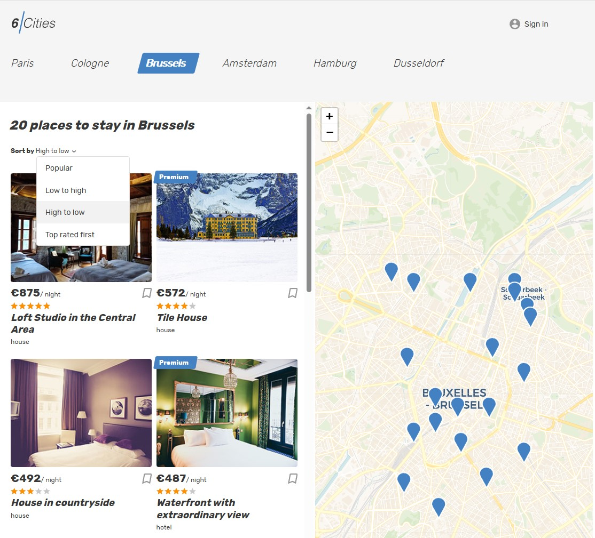
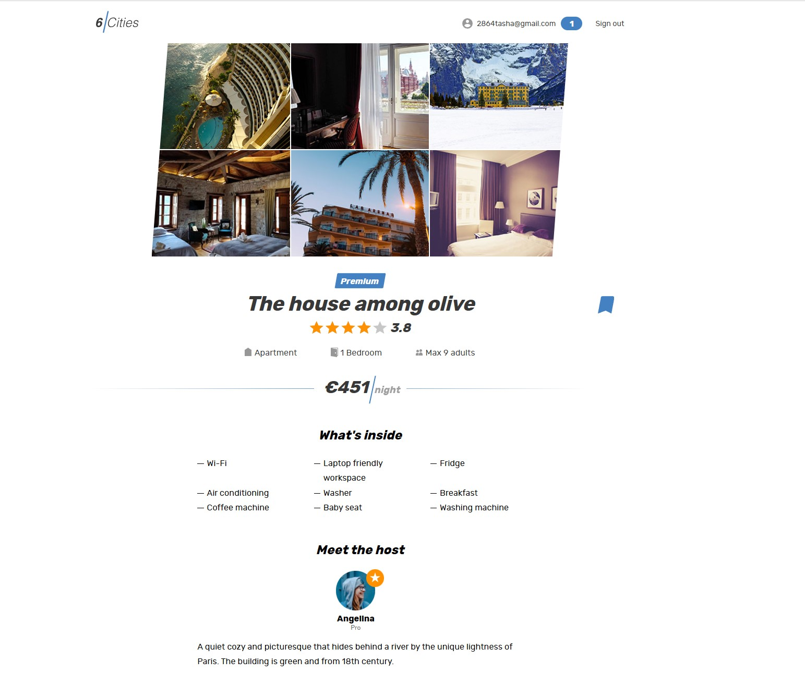
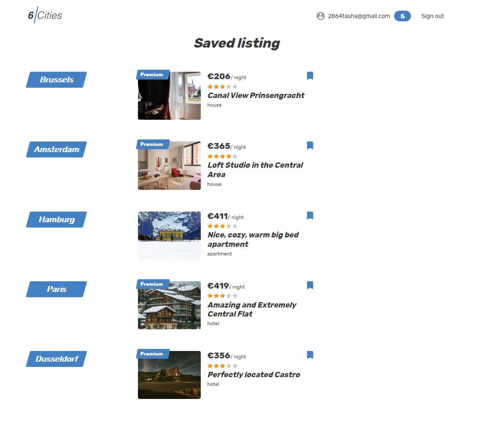

# Six Cities 🌆

**Six Cities** is a modern service for travelers to find rental accommodations without overpaying.  
Choose one of six popular travel cities and explore curated rental offers with detailed property information, map views, and a clean, intuitive interface.

---

## 🌟 Features

- **Main Page (/)** – Browse rental offers by city.  
- **Login Page (/login)** – User authentication.  
- **Favorites (/favorites)** – Private page showing favorite properties (requires login).  
- **Offer (/offer/:id)** – Detailed property view with map.  
- **404 Handling** – Non-existent pages redirect to a 404 page with a link back to Main.  

---

## 🧭 Header Behavior

- Displays **Login** if not logged in.  
- Displays **user email + Log Out** if logged in.  
- Clicking **Log Out** ends the session.  
- Clicking **email** navigates to Favorites page.  

---

## 🛠️ Tech Stack

**Frontend:** React, React Router  
**State Management:** Redux / Context API  
**Styling:** CSS / SCSS / Styled Components  
**Authentication:** JWT / Session-based  

---

## 🚀 Getting Started

# Clone the repository
git clone https://github.com/BNA-projects/6-cities-eng.git

# Navigate to the project folder
cd skyprowallet

# Install dependencies
npm install

# Run the project
npm run start

---

## 🖼️ Screenshots

### **Main Page**  

### **Offer Page**  

### **Favorites Page**  

